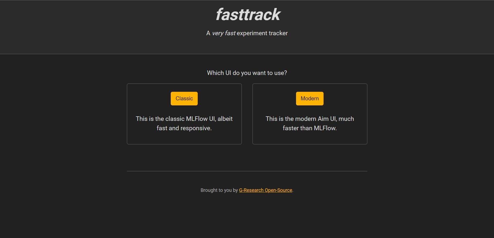

[](https://fasttrackml.io/)

# _FastTrackML_
Rewrite of the MLFlow tracking server with a focus on scalability

### Quickstart

#### Run the tracking server

For the full guide, see [docs/quickstart.md](docs/quickstart.md).

FastTrackML can be run using the following command:

```bash
docker run --rm -p 5000:5000 -ti gresearch/fasttrackml
```

Verify that you can see the UI by navigating to http://localhost:5000/.



For more info, `--help` is your friend!

#### Track your experiments

Here's an elementary example using the server:

```bash
pip install tensorflow mlflow

cat << EOF > /tmp/fasttrackml-example.py
import tensorflow as tf
import mlflow
data = tf.keras.datasets.fashion_mnist

mlflow.set_tracking_uri("http://localhost:5000")
mlflow.tensorflow.autolog()

(training_images, training_labels), (test_images, test_labels) = data.load_data()

training_images  = training_images / 255.0
test_images = test_images / 255.0

model = tf.keras.models.Sequential([
            tf.keras.layers.Flatten(input_shape=(28, 28)),
            tf.keras.layers.Dense(128, activation=tf.nn.relu),
            tf.keras.layers.Dense(10, activation=tf.nn.softmax)
        ])

model.compile(optimizer='adam',
              loss='sparse_categorical_crossentropy',
              metrics=['accuracy'])
model.fit(training_images, training_labels, epochs=10)
model.evaluate(test_images, test_labels)
EOF

python /tmp/fasttrackml-example.py
```


#### Encryption at rest

To use an encrypted SQLite database, use the query parameter `_key` in the DSN:

```
docker run --rm -p 5000:5000 -ti gresearch/fasttrackml server --database-uri 'sqlite:///data/fasttrackml.db?_key=passphrase'
```

### Developer

Using the project's devcontainer is recommended for development. VSCode should detect
the .devcontainer folder and offer to restart the IDE in that context. For other users,
the underlying docker container can be used. The Makefile offers some basic targets.

```
cd .devcontainer
docker-compose up -d
docker-compose exec app bash

root ➜ /go $ cd /workspaces/fasttrack
root ➜ /workspaces/fastrack $ make build
root ➜ /workspaces/fastrack $ make run
root ➜ /workspaces/fastrack $ make test
root ➜ /workspaces/fastrack $ emacs .
```

Note that on MacOS, port 5000 is already occupied, so some adjustments are necessary.

### License

Copyright 2022-2023 G-Research

Copyright 2019-2022 Aimhub, Inc.

Copyright 2018 Databricks, Inc.

Licensed under the Apache License, Version 2.0 (the "License"); you may not use these files except in compliance with the License.
You may obtain a copy of the License at

http://www.apache.org/licenses/LICENSE-2.0

Unless required by applicable law or agreed to in writing, software
distributed under the License is distributed on an "AS IS" BASIS,
WITHOUT WARRANTIES OR CONDITIONS OF ANY KIND, either express or implied.
