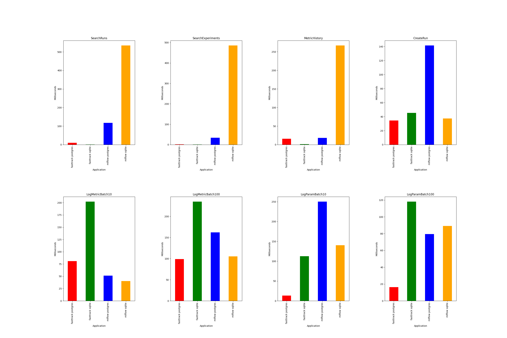

# FastTrackML Benchmark Suite

## Introduction

FastTrackML Benchmark Suite is a project designed to provide a
comprehensive and user-friendly performance benchmarking system for
FastTrackML, with a specific focus on comparing its capabilities with
other popular machine learning parameter servers, such as MLflow. This
documentation aims to guide users on how to use FastTrackML
Performance Benchmark effectively.

## Table of Contents

- [FastTrackML Benchmark Suite](#fasttrackml-benchmark-suite)
  - [Introduction](#introduction)
  - [Table of Contents](#table-of-contents)
  - [1. Findings](#1-findings)
  - [2. Getting Started ](#2-getting-started-)
  - [3. Methodology](#3-methodology)
  - [4. Usage ](#4-usage-)
    - [Benchmarking Performance ](#benchmarking-performance-)

## 1. Findings

In general, the Benchmark Suite shows FastTrackML to perform better
than MLflow, both for logging and retrieval endpoints, with a notable
exception: writing against a Sqlite backend. In this case, MLflow
provides equal or better performance. Sqlite is single-threaded for
write operations (such as logging metrics or creating a run), so we do
strongly recommend using Postgres for any substantive workloads.



## 2. Getting Started <a name="getting-started"></a>

To run the performance benchmark ensure you have Docker and Docker
Compose installed and run the following command:

```bash
./run.sh
```

## 3. Methodology
For the implementation of the performance benchmarking we used
[K6](https://k6.io) which is a developer load testing tool. We then
used docker containers of 4 different applications: 2 variations of
MLflow (sqlite and postgresql), and 2 variations of FastTrackML
(sqlite and postgresql).

For FastTrackML we used the standard container image provided by
G-research from docker hub, while for MLflow we used the `python:3.8`
image running on linux and started the mflow server by installing the
mlflow python package on the image.

We used the features provided natively by k6 to run the tests
concurrently and iteratively. For each test on the applications we ran
them using 20 virtual users concurrently running 100 iterations on
each tested endpoint. This sums up to 2000 tests on each tested
endpoint.

We run 2 different types suites of tests. The first is logging where
we test the application's ability to log concurrent requests
iteratively and we measure the latency of the application in handling
these requests. The second is retrieval where we tests the
application's latency in returning data when queried concurrently by
virtual users iteratively.

## 4. Usage <a name="usage"></a>

### Benchmarking Performance <a name="benchmarking-performance"></a>

FastTrackML benchmark suite allows you to test the performance of the
FastTrackML project and compare it to MLFlow through the REST API. We
do this by orchestrating 4 containers to to be tested:
- FastTrackML with sqlite
- FastTrackML with postgres
- MLflow with sqlite
- MLflow with postgres

We then performed 2 categories of API benchmark tests on them using
the K6 benchmarking tool. The categories of tests are:
- Logging (throughput)
- Retrieval

You run tests on any of these platforms in isolation for example:

 To test FastTrackML postgres in isolation:

```bash
docker compose up logging_test_fasttrack_postgres
```

 To test performance of MLflow sqlite:

```bash
docker compose up retrieval_test_mlflow_sqlite
```

To run all test and generate report, run:
```bash
./run.sh
```

*Note* These tests in isolation will generate csv report files, but
will not generate report images. To generate a report image you will
have to run all the tests on all 4 instances then use the
`generateReports.py` script to generate the `performanceReport.png`
image

*Note* For the performance tests to work you must have a
`\benchmark_outputs` folder in this directory. If you are running the
performance benchmarks without the `run.sh` script you will have to
create this folder manually.
