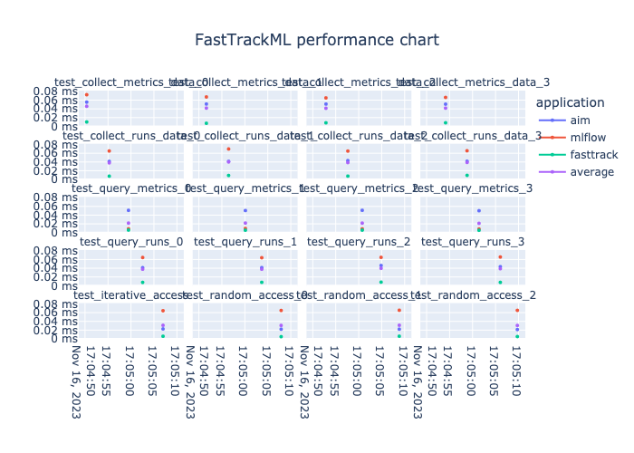

# FastTrack ML Benchmark Suite

## Introduction

FastTrack ML Benchmark Suite is a project designed to provide a comprehensive and user-friendly performance tracking system for FastTrack ML, with a specific focus on comparing its capabilities with other popular machine learning parameter servers, such as MLflow. This documentation aims to guide users on how to use FastTrack ML Performance Tracker effectively.

## Table of Contents

- [FastTrack ML Benchmark Suite](#fasttrack-ml-benchmark-suite)
  - [Introduction](#introduction)
  - [Table of Contents](#table-of-contents)
  - [2. Getting Started ](#2-getting-started-)
  - [3. Usage ](#3-usage-)
    - [Tracking Experiments ](#tracking-experiments-)
    - [Results ](#results-)
  - [4. Advanced Features ](#4-advanced-features-)
    - [Custom Metrics ](#custom-metrics-)
    - [Visualization ](#visualization-)
  - [5. Contributing ](#5-contributing-)
  - [6. License ](#6-license-)

## 2. Getting Started <a name="getting-started"></a>

To run the performance tracker ensure you have docker and docker compose installed and run the following commands 

```bash
docker-comopose up performance-tests
```

## 3. Usage <a name="usage"></a>

### Tracking Experiments <a name="tracking-experiments"></a>

FastTrack ML benchmark suite allows you to test the performance of the FastTrackML project and compare it to other machine learning experiment trackers such as MLFlow and Aim

1. To test FastTrackML in isolation:

```bash
docker-comopose up performance-tests
```

2. To test performance as compared to MLFlow and Aim:

```bash
docker-comopose up performance-tests --compare=True
```

### Results <a name="comparing-with-mlflow"></a>

FastTrack ML Performance Tracker is designed to provide features similar to MLflow. You can compare the two as follows:


FastTrack ML Performance Tracker offers similar functionality as MLflow but may provide additional features and customization options to meet specific project requirements.

## 4. Advanced Features <a name="advanced-features"></a>

### Custom Metrics <a name="custom-metrics"></a>

You can define custom metrics and log them within your experiments:

```python
tracker.log_custom_metric("f1_score", 0.88)
```

### Visualization <a name="visualization"></a>

FastTrack ML Performance Tracker provides visualization tools for metrics and parameters, making it easier to analyze your experiments. You can use these visualizations to create graphs, charts, and reports for your machine learning projects.

## 5. Contributing <a name="contributing"></a>

If you'd like to contribute to FastTrack ML Performance Tracker, please see our [contribution guidelines](CONTRIBUTING.md) for details on how to get involved.

## 6. License <a name="license"></a>

FastTrack ML Performance Tracker is distributed under the [MIT License](LICENSE.md). Please review the license before using or contributing to the project.

For any questions, issues, or support, please refer to the project's [GitHub repository](https://github.com/yourusername/fasttrack-ml-performance-tracker).

---

Thank you for choosing FastTrack ML Performance Tracker! We hope this documentation helps you effectively track and manage your machine learning experiments and compare it with other parameter servers like MLflow.