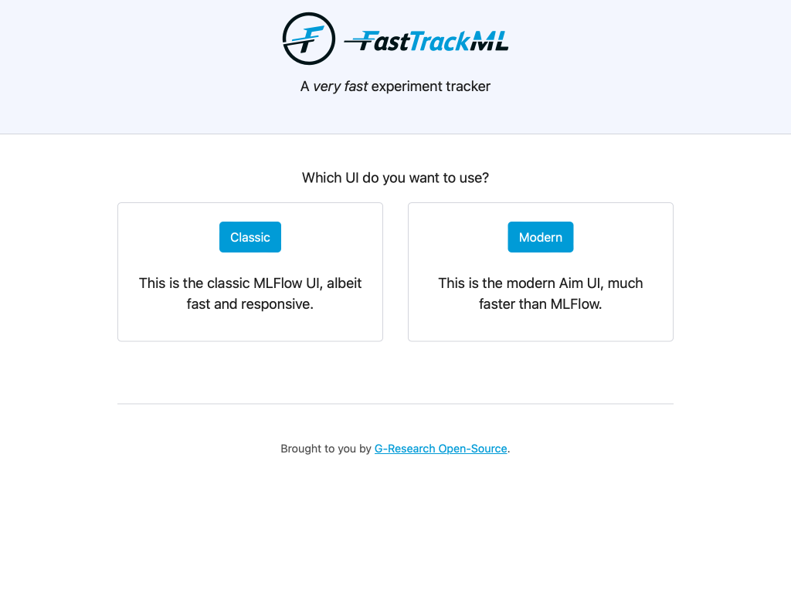

# FastTrackML Quickstart

## Install FastTrackML

### With `pip`

```bash
pip install fasttrackml
```

### With a script

#### On Linux and macOS

```bash
curl -fsSL https://fasttrackml.io/install.sh | sh
```

#### On Windows

```bash
iwr -useb https://fasttrackml.io/install.ps1 | iex
```

### Manually

Download the executable for your platform from the [latest release](https://github.com/G-Research/fasttrackml/releases/latest) assets.
Extract it and then validate your installation with the following command:

```bash
./fml --version
```

## Run FastTrackML

### Natively

```bash
fml server
```

### Via Docker

You can also run FastTrackML in a container via [Docker](https://docs.docker.com/get-docker/):

```bash
docker run --rm -p 5000:5000 -ti gresearch/fasttrackml
```

### Deploy Helm chart

You can also run FastTrackML in a Kubernetes via [Helm](https://helm.sh/docs/intro/install/):

```bash
helm install fasttrackml ./helm/fasttrackml
```

### Verification

Verify that you can see the UI by navigating to http://localhost:5000/.



## Run a quick test script

To run the test scripts, you need a working [Python](https://www.python.org/downloads/) installation and the [Poetry](https://python-poetry.org/docs/#installation) package manager.

```bash
# Install mflow and poetry
cd docs/example
poetry install
poetry run python3 minimal.py
```

After running this script, you should see the following output from http://localhost:5000/aim/:


From here you can check out the metrics and run information to see more details about the run.
