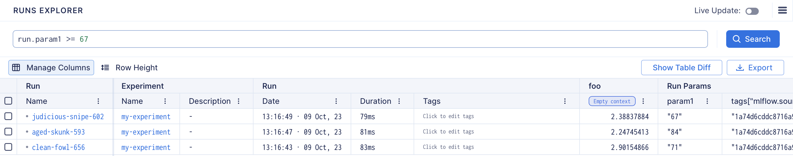
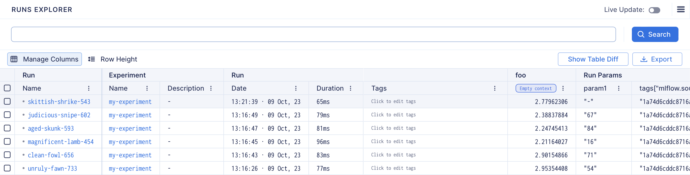
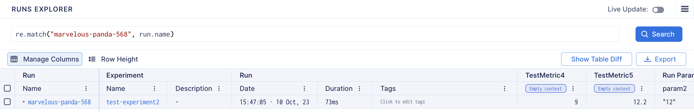
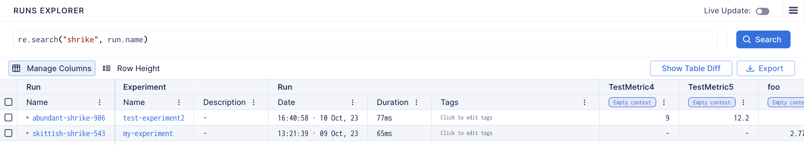

# Search Syntax Documentation
## Introduction
This document serves as a guide to the search syntax that enables users to effectively filter metrics and runs. 

The syntax follows Python conventions, in the sections that follow, we will delve into the specifics of the supported operations and provide examples.

- [Search Runs](#search-runs)
- [Search Metrics](#search-metrics)
- [Operations](#operations)
  - [String operations](#string-operations)
  - [Numeric operations](#numeric-operations)
  - [Boolean operations](#boolean-operations)
    - [Implicit Boolean comparison](#implicit-boolean-comparison)
  - [Logical operations](#logical-operations)
  - [```in``` operator](#in-operator)
- [Search run examples](#search-run-examples)
  - [Example with ```run.name``` (string)](#example-with-runname-string)
  - [Example with ```run.duration``` (numeric)](#example-with-runduration-numeric)
  - [Example with ```run.archived``` (boolean)](#example-with-runarchived-boolean)
  - [Run parameters](#run-parameters)
  - [Filtering Runs with Unset Parameters](#filtering-runs-with-unset-parameters)
  - [Filter Runs using Regular Expressions](#filter-runs-using-regular-expressions)
  - [Complex query for run search](#complex-query-for-run-search)
- [Search metrics examples](#search-metrics-examples)
  - [Example with ```metric.name``` (string)](#example-with-metricname-string)
  - [Example with ```metric.last``` (numeric)](#example-with-metriclast-numeric)
  - [Filter Metrics by run](#filter-metrics-by-run)
  - [Complex query for metric search](#complex-query-for-metric-search)


## Search Runs
You can filter the runs using the following attributes associated with the ```run``` object:
| Property               | Description                                         | Type             |
| ---------------------- | --------------------------------------------------- | ---------------- |
| ```run.name```         | Run name                                            | ```string```     |
| ```run.hash```         | Run hash                                            | ```string```     |
| ```run.experiment```   | Experiment name                                     | ```string```     |
| ```run.tags```         | List of run tags                                    | ```dictionary``` |
| ```run.archived```     | True if run is archived, otherwise False            | ```boolean```    |
| ```run.active```       | True if run is active(in progress), otherwise False | ```boolean```    |
| ```run.duration```     | Run duration in seconds                             | ```numeric```    |
| ```run.created_at```   | Run creation datetime                               | ```numeric```    |
| ```run.finalized_at``` | Run end datetime                                    | ```numeric```    |
| ```run.metrics```      | Set of run metrics                                  | ```dictionary``` |

## Search Metrics
You can filter the metrics using the following metric attributes associated with the ```metric``` object:
| Property                | Type          |
| ----------------------- | ------------- |
| ```metric.name```       | ```string```  |
| ```metric.last```       | ```numeric``` |
| ```metric.last_step```  | ```numeric``` |
| ```metric.first_step``` | ```numeric``` |

## Operations

### String operations
For the ```string``` attributes you can use the following comparison operator:
- ``` == ```
- ``` != ```
- ``` in ```
- ``` .startswith() ```
- ``` .endswith() ```
- ``` re.match() ```
- ``` re.search() ```

### Numeric operations
For the ```numeric``` attributes you can use the following comparison operator:
- ``` == ```
- ``` != ```
- ``` > ```
- ``` >= ```
- ``` < ```
- ``` <= ```

### Boolean operations
For the ```boolean``` attributes you can use the following comparison operator:
- ``` == ```
- ``` != ```

#### Implicit Boolean comparison
You can also use boolean attributes directly in a conditional statement without any comparison operator. 

Equivalent to comparing the attribute to True.

```python
run.archived  # Checks if run.archived is equal to True
```
Equivalent to comparing the attribute to False.
```python
not run.archived  # Checks if run.archived is equal to False
```
### Logical operations
You can create complex search queries combining multiple conditions with logical operators.
- ``` and ```
- ``` or ```
- ``` not ```

### ```in``` operator
The ```in``` operator can also be used for checking whether a value is in a list

```python
run.experiment in ["my-first-experiment", "my-second-experiment"]
```

## Search run examples

### Example with ```run.name``` (string)
Select only the runs where the name exactly matches "TestRun1"

```python
run.name == "TestRun1"
```

Select only the runs where the name is different from "TestRun1"
```python
run.name != "TestRun1"
```

Select only the runs where "Run1" is contained in the run name
```python
"Run1" in run.name
```

Select only the runs where the name starts with "Test"
```python
run.name.startswith('Test')
```

Select only the runs where the name ends with "Run1"
```python
run.name.endswith('Run1')
```

### Example with ```run.duration``` (numeric)

Select only the runs where the duration is exactly 3600 seconds (1 hour)

```python
run.duration == 3600
```

Select only the runs where the duration is greater or equal to 3600 seconds (1 hour)
```python
run.duration >= 3600
```

Select only the runs where the duration is less than 3600 seconds (1 hour)
```python
run.duration < 3600
```

### Example with ```run.archived``` (boolean)
Select only the runs where the archived attribute is true
```python
run.archived
```

Select only the runs where the archived attribute is not true
```python
not run.archived
```

### Run parameters
Run parameters can be accessed via attributes.


### Filtering Runs with Unset Parameters

To filter runs based on whether a parameter is not set, you can use the following syntax:

```python
run.attribute is None
```
This expression will return runs for which the specified parameter is not defined.

Showing all the runs


Showing only the runs where param1 is not set


### Filter Runs using Regular Expressions

Match finds an exact match at the beginning of a string.


Search looks for a pattern anywhere in the string.


### Complex query for run search
The query selects the runs that meet the following conditions:


- ```run.archived``` can be either ```True``` or ```False```.
- The duration of ```run``` must be greater than ```0```.
- The ```run``` has to contain a metric named ```'TestMetric'``` and its last recorded value must be greater than ```2.5```.
- The name of ```run``` should not end with ```'4'```.
  
```python
(run.archived == True or run.archived == False) and run.duration > 0 and run.metrics['TestMetric'].last > 2.5 and not run.name.endswith('4')
```

## Search metrics examples

### Example with ```metric.name``` (string)
Select only the metrics where the name exactly matches "TestMetric1"
```python
metric.name == "TestRun1"
```

Select only the metrics where the name starts with "Test"
```python
metric.name.startswith('Test')
```

### Example with ```metric.last``` (numeric)

Select only the metrics where the last value is exactly 1.1

```python
metric.last == 1.1
```

Select only the metrics where the duration is greater or equal to 1.1
```python
metric.last >= 1.1
```

Select only the metrics where the last value is less than 1.1
```python
metric.last < 1.1
```

### Filter Metrics by run
You can also filter the metrics by combining  metric attributes with run attributes.

Showing the metrics with the last value greater than 6 belonging to a run with the name that starts with marvelous.


### Complex query for metric search
The query selects the metrics that meet the following conditions:

- The ```metric.name``` field must be ```"TestMetric1"``` or ```"TestMetric2"```.
- The``` metric.last_step``` field must be greater than or equal to ```1```.
- The ```run.name``` field must either end with ```"2"``` or start with ```"TestRun1"```.
- The ```metric.last``` field must be less than ```1.6```.
- The ```run.duration``` must be greater than ```0```.
  
```python
((metric.name == "TestMetric1") or (metric.name == "TestMetric2")) and metric.last_step >= 1 and (run.name.endswith("2") or re.match("TestRun1", run.name)) and (metric.last < 1.6) and run.duration > 0
```
