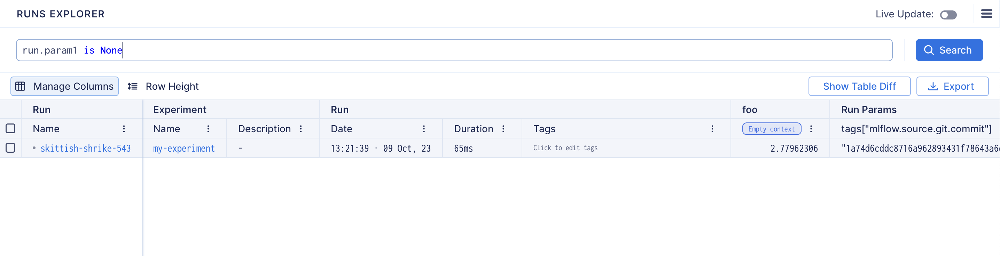
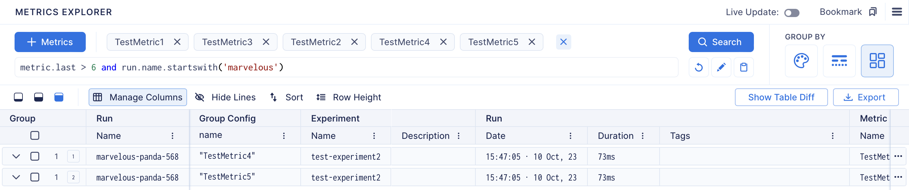

# Search Syntax Documentation

## Introduction

This document provides an overview of the search syntax that users can utilize to filter metrics and runs.

## Search Runs
You can filter the runs using the following run attributes:
| Property           | Description                                         | Type             |
| ------------------ | --------------------------------------------------- | ---------------- |
| ```name```         | Run name                                            | ```string```     |
| ```hash```         | Run hash                                            | ```string```     |
| ```experiment```   | Experiment name                                     | ```string```     |
| ```tags```         | List of run tags                                    | ```dictionary``` |
| ```archived```     | True if run is archived, otherwise False            | ```boolean```    |
| ```active```       | True if run is active(in progress), otherwise False | ```boolean```    |
| ```duration```     | Run duration in seconds                             | ```numeric```    |
| ```created_at```   | Run creation datetime                               | ```numeric```    |
| ```finalized_at``` | Run end datetime                                    | ```numeric```    |
| ```metrics```      | Set of run metrics                                  | ```dictionary``` |

## Search Metrics
You can filter the metrics using the following metric attributes:
| Property         | Type          |
| ---------------- | ------------- |
| ```name```       | ```string```  |
| ```last```       | ```numeric``` |
| ```last_step```  | ```numeric``` |
| ```first_step``` | ```numeric``` |

### String operations
For the ```string``` attributes you can use the following comparing operator:
- ``` == ```
- ``` != ```
- ``` in ```
- ``` .startswith() ```
- ``` .endswith() ```

### Numeric operations
For the ```numeric``` attributes you can use the following comparing operator:
- ``` == ```
- ``` != ```
- ``` > ```
- ``` >= ```
- ``` < ```
- ``` <= ```

### Boolean operations
For the ```boolean``` attributes you can use the following comparing operator:
- ``` == ```
- ``` != ```

### Logical operations
You can create complex search queries combining multiple conditions with logical operators.
- ``` and ```
- ``` or ```
- ``` not ```


#### Example with ```run.name``` (string)
Select only the runs where the name exactly matches "TestRun1"

```python
run.name == "TestRun1"
```

Select only the runs where the name is different from "TestRun1"
```python
run.name != "TestRun1"
```

Select only the runs where "Run1" is contained in the run name
```python
"Run1" in run.name
```

Select only the runs where the name starts with "Test"
```python
run.name.startswith('Test')
```

Select only the runs where the name ends with "Run1"
```python
run.name.endswith('Run1')
```

#### Example with ```run.duration``` (numeric)

Select only the runs where the duration is exactly 111111111

```python
run.duration == 111111111
```


Select only the runs where the duration is not 111111111
```python
run.duration != 111111111
```

Select only the runs where the duration is greater than 111111111
```python
run.duration > 111111111
```

Select only the runs where the duration is greater or equal to 111111111
```python
run.duration >= 111111111
```

Select only the runs where the duration is less than 111111111
```python
run.duration < 111111111
```

Select only the runs where the duration is less or equal to 111111111
```python
run.duration <= 111111111
```

#### Example with ```run.archived``` (boolean)
Select only the runs where the archived attribute is true
```python
run.archived == True
```

Select only the runs where the archived attribute is not true
```python
run.archived != True
```

### Run parameters
Run parameters could be accessed via attributes.
```python
run.hparams.param1 >= 64
```


### Filtering Runs with Unset Attributes

To filter runs based on whether an attribute is not set, you can use the following syntax:

```python
run.attribute is None
```
This expression will return runs for which the specified attribute is not defined.

Showing all the runs


Showing only the runs where param1 is not set


### Filter Runs using Regular Expressions
- ``` .match() ```
- ``` .search() ```

Match finds an exact match at the beginning of a string.


Search looks for a pattern anywhere in the string.


#### Example with ```metric.name``` (string)
Select only the metrics where the name exactly matches "TestMetric1"
```python
metric.name == "TestRun1"
```

Select only the metrics where the name is different from "TestMetric1"
```python
metric.name != "TestRun1"
```

Select only the metrics where "Run1" is contained in the run name
```python
"Metric1" in metric.name
```

Select only the metrics where the name starts with "Test"
```python
metric.name.startswith('Test')
```

Select only the metrics where the name ends with "Metric1"
```python
metric.name.endswith('Metric1')
```

#### Example with ```metric.last``` (numeric)

Select only the metrics where the last value is exactly 1.1

```python
metric.last == 1.1
```

Select only the metrics where the last value is not 1.1
```python
metric.last != 1.1
```

Select only the metrics where the last value is greater than 1.1
```python
metric.last > 1.1
```

Select only the metrics where the duration is greater or equal to 1.1
```python
metric.last >= 1.1
```

Select only the metrics where the last value is less than 1.1
```python
metric.last < 1.1
```

Select only the metrics where the last value is less or equal to 1.1
```python
metric.last <= 1.1
```

### Filter Metrics by run
You can also filter the metrics by combining  metric attributes with run attributes.

Showing the metrics with the last value greater than 6 belonging to a run with the name that starts with marvelous.


